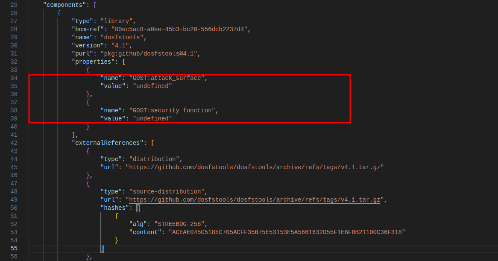
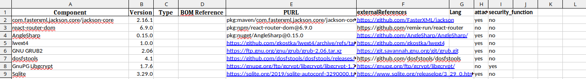
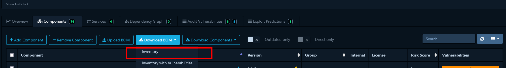
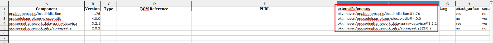
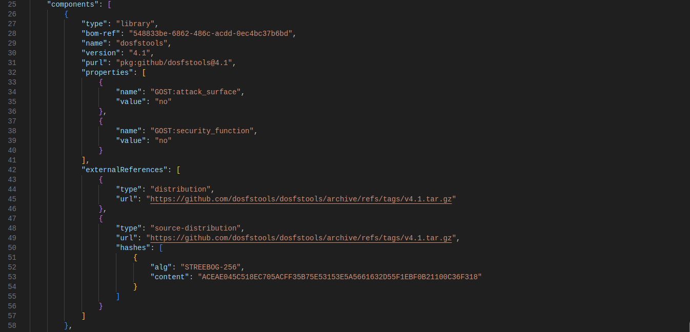
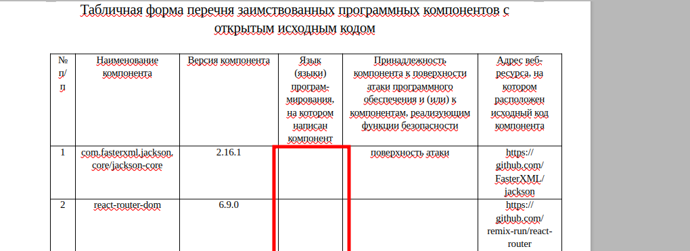

# SbomTransfer
```
Description: Пак конвертеров для формирования комплекта заимствованных компонентов серт. продуктов.
Author: @sigdevel by Aladdin R.D. 2025
Version: 1.0
Created: 25-12-2024
License: GNU AGPL v3.0
Source-repo: https://github.com/sigdevel/SbomTransfer/
```
### TL;DR
Реализовано в соответвии с KISS principle (Keep it simple, stupid!) - инструмент не претендует на полноту закрытия всех последующих требований регулятора по предоставлению перечней заимствованных программных компонентов с открытым исходным кодом, однако, может быть полезным в качестве первого шага при оценке компонетов в вашей инфраструктуре, без необходимости затрат на проприетарные средства анализа.


### 0. Поддерживаемые на момент публикации типы PURL:
```
🟩 npm
🟩 nuget
🟩 maven
🟩 github
🟩 generic
```
##### Примеры поддерживаемых типов, в соответствии с purl-spec приведены в `./debug-examples`
##### Для добавления других типов, см.: https://github.com/package-url/purl-spec 

### 1.1 Требования к заполнению xlsx-табилицы (Основное):

##### Для форматов: maven, github, generic и npm, достаточным для корректного разбора будет заполненное значение колонок Component+Version+externalReferences. 

 🟩 Обязательные
 🟥 Опциональные

```
🟩 Component
🟩 Version
🟥 Type
🟥 BOM Reference
🟥 PURL
🟩 externalReferences
🟥 Lang
🟩 attack_surface
🟩 security_function
```

В случае отсутствия заполнения колонок "attack_surface" и "security_function", значения полей будут заполнены из шаблона - "undefined".


### 1.2. Требования к заполнению xlsx-таблицы (Исключения):

##### Для формата nuget, обязательными к заполнению являются только "Component" и "Version"
Пример заполнения (`./debug-examples/multitype.xlsx`)
```
🟩 github (строки 2-4) ;
🟩 maven (строки 5-8) ;
🟩 npm (строки 9-11) ;
🟩 nuget (строки 12-15) ;
```


#### 2. Действия перед запуском:
##### 2.1. Создать и активировать виртуальное окружение.
```bash
python3 -m venv venv
source venv/bin/activate
```
##### 2.2. Установить перечисленные модули с зависимостями, указанными в файле `requirements.txt`.
```bash
pip install -r requirements.txt
```

#### 3. Примеры использования:
### ✅ Выгрузка из Dependency-Track
#### 3.1 Выбрать проект, далее во вкладке "Components", выбрать простое скачивание (Inventory).


#### 3.2 Произвести конвертацию в табличное представление утилитой json-to-xlsx.py


#### 3.3 Произвести открытие полученного файла. 

#### 3.4 Произвести аудит компонентов, заполнить недостающие колонки.


#### 3.5 Сохранить заполненную таблицу.


#### 3.6 Произвести конвертацию в машиночитаемое представление утилитой xlsx-to-json.


#### 3.7 В случае успеха, каждый компонент из конвертируемой таблицы, будет корректно перенесен в требуемый формат.


#### 3.8 Произвести проверку полученного sbom-файла утилитой sbom-checker.py из пакета https://gitlab.community.ispras.ru/sdl-tools/sbom-checker


#### 3.9 Произвести конвертацию sbom-файла в odt-представление утилитой sbom-to-odt.py из пакета https://gitlab.community.ispras.ru/sdl-tools/sbom-checker


#### 3.10 Произвести валидацию odt-файла, в случае необходимости, заполнить колонку `"Язык (языки) программирования, на котором написан компонент"`.


### ✅ 4. Ручное формирование списка
#### Поддерживаемые форматы указаны в разделе выше - `Поддерживаемые типы PURL`.
#### 4.1 Подготовить xlsx-файл, учитывая минимальные требования к формату (см.требования к заполнению xlsx-таблицы выше в разделе "Требования к заполнению xlsx-таблицы").


#### 4.2 Сохранить заполненную таблицу.

#### 4.3 Произвести конвертацию в машиночитаемое представление утилитой xlsx-to-json.


#### 4.4 В случае успеха, каждый компонент из конвертируемой таблицы, будет корректно перенесен в требуемый формат.


#### 4.5 Произвести проверку полученного sbom-файла утилитой sbom-checker.py из пакета https://gitlab.community.ispras.ru/sdl-tools/sbom-checker


#### 4.6 Произвести конвертацию sbom-файла в odt-представление утилитой sbom-to-odt.py из пакета https://gitlab.community.ispras.ru/sdl-tools/sbom-checker


#### 4.7 Произвести валидацию odt-файла, в случае необходимости, заполнить колонку `"Язык (языки) программирования, на котором написан компонент"`

