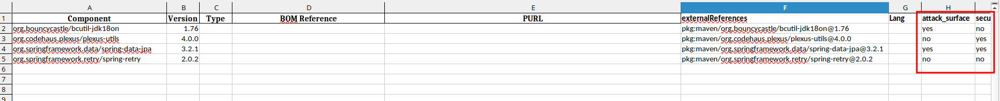
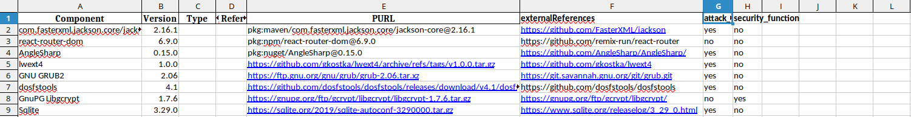

# deptrackSbomTransfer

##### Пак конвертеров для формирования комплекта заимствованных компонентов серт. продуктов


##### Поддерживаемые типы PURL:
- {+ nuget+} ;
- {+ maven+} ;
- {+ github+} ;
- {+ generic+} ;
##### Примеры поддерживаемых типов, в соотвествии с purl-spec приведены в `./debug-examples`
##### Для добавления других типов, см.: https://github.com/package-url/purl-spec 

##### Требования к заполнению xlsx-табилицы:
##### {+ Обязательные+}
##### {- Опциональные-}
`
`
{+ Component+}
{+ Version+}
{- Type-}
{- BOM Reference-}
{+ PURL+}
{+ externalReferences+}
{- Lang-}
{+ attack_surface+}
{+ security_function+}
`
`


#### Перед запуском:
##### 1. Создать и активировать виртуальное окружение.
```bash
python3 -m venv venv
source venv/bin/activate
```
##### 2. Установить перечисленные модули с зависимостями, указанными в файле `requirements.txt`.
```bash
pip install -r requirements.txt
```

## Примеры использования:
### {+ 1. Выгрузка из deptrack+}
#### 1.1 Выбрать проект, далее во вкладке "Components", выбрать простое скачивание (Inventory).


#### 1.2 Произвести конвертацию в табличное представление утилитой json-to-xlsx.py


#### 1.3 Произвести открытие полученного файла. 
##### Если внешние ссылки в проекте deptrack-а были заполнены ранее, мы получим заполнение колонки externalReferences, как на скриншоте ниже:


#### 1.4 Произвести аудит компонентов, заполнить недостающие колонки.


#### 1.5 Сохранить заполненную таблицу.


#### 1.6 Произвести конвертацию в машино-читаемое представление утилитой xlsx-to-json.py.


#### 1.7 В случае успеха, каждый компонент из конвертируемой таблицы, будет корректно перенесен в требуемый формат.


#### 1.8 Произвести проверку полученного sbom-файла утилитой sbom-checker.py из пакета https://gitlab.community.ispras.ru/sdl-tools/sbom-checker


#### 1.9 Произвести конвертацию sbom-файла в odt-представление утилитой sbom-to-odt.py из пакета https://gitlab.community.ispras.ru/sdl-tools/sbom-checker


#### 1.10 Произвести валидацию odt-файла, в случае необходимости, заполнить колонку `"Язык (языки) программирования, на котором написан компонент"`.


### {+ 2. Ручное формирование списка+}
#### Поддерживаемые форматы указаны в разделе выше - `Поддерживаемые типы PURL`.
#### 2.1 Подготовить xlsx-файл, учитывая минимальные требования к формату (см.требования к заполнению xlsx-табилицы).


#### 2.2 Сохранить заполненную таблицу.

#### 2.3 Произвести конвертацию в машино-читаемое представление утилитой xlsx-to-json.py.


#### 2.4 В случае успеха, каждый компонент из конвертируемой таблицы, будет корректно перенесен в требуемый формат.


#### 2.5 Произвести проверку полученного sbom-файла утилитой sbom-checker.py из пакета https://gitlab.community.ispras.ru/sdl-tools/sbom-checker


#### 2.6 Произвести конвертацию sbom-файла в odt-представление утилитой sbom-to-odt.py из пакета https://gitlab.community.ispras.ru/sdl-tools/sbom-checker


#### 2.7 Произвести валидацию odt-файла, в случае необходимости, заполнить колонку `"Язык (языки) программирования, на котором написан компонент"`


##### TODO:
1. Изучить используемые типы на внутрненнем deptrack (как минимум сейчас не был учтен формат для golang) - добавить в поддержку ;
2. Произвести проверки в generic - существует проблема, при которой версии некоторых компонентов попадают в выходной json без кавычек ;
3. Добавить поддержку других форматов архивов (сейчас для оценки корректности работы cpverify поддерживается только tgz)
